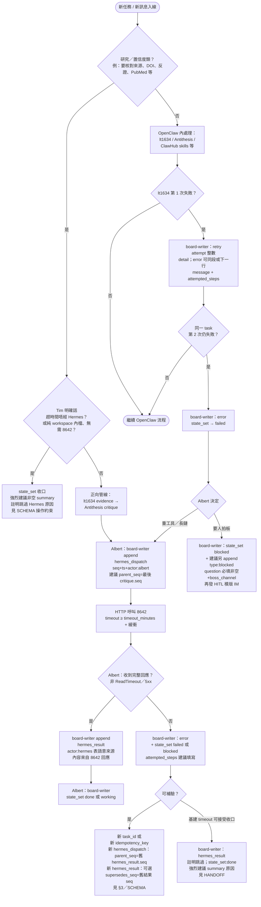

# 何時轉 Hermes（8642）— 決策樹

對齊 **[HANDOFF_HERMES.md](./HANDOFF_HERMES.md)**、**[COMPANY_BOARD_SCHEMA.md](./COMPANY_BOARD_SCHEMA.md)**、**Albert `templates/openclaw-company/albert/AGENTS.md`**。  
**原則**：所有 **board 實體 append** 經 **board-writer**（單一入口）；Albert 派工嘅 entry 由 Albert 觸發；**Hermes** 喺 **`hermes_async_dispatch`／自寫 `hermes_result`／`timeout_warning`** 可**直接**呼叫 writer，並以 **`writer: hermes`** 標示。Hermes **唔共用** OpenClaw IM bot。

---

## 1. Mermaid 決策樹（觸發條件）

---

## 2. 任務板事件順序（對照 `type`）

| 階段 | 建議 `type`（append 順序） | 誰觸發寫入 |
|------|---------------------------|------------|
| 開工 | `state_set` → `working`，派 owner | Albert → **board-writer** |
| 搜證 | `evidence`（+ `refs`） | lt1634 → Albert → **board-writer** |
| 反駁 | `critique`（可記 `seq` 供下游 `parent_seq`） | Antithesis → Albert → **board-writer** |
| 派 Hermes | **`hermes_dispatch`**（每行必備 **`seq`、`ts`、`task_id`、`actor: albert`**，見 §3） | Albert → **board-writer** |
| 取結果 | **`hermes_result`**（`summary`／`error`，`idempotency_key`；**`actor: hermes` 表語意，`writer: hermes` 表直接寫入**） | **Albert 派工**：Albert（或自動化）→ board-writer；**Hermes 自寫範圍**：Hermes 直接 → board-writer，標示 `writer: hermes` |
| 收口 | `state_set` → `done`／`failed`／`blocked` | Albert → **board-writer** |
| 失敗重試 | `retry`（**`attempt`**）、`error`（**`message`、`attempted_steps`**） | 依 SCHEMA → **board-writer** |
| 等人類 | `state_set`+`state:blocked` **及** 建議獨立 **`type: blocked`**（**`question` 必填非空**、`boss_channel`）→ IM → `boss_reply` | Albert → **board-writer** |

**正向管線硬性約定**（研究類）：Antithesis 之後、`done` 之前，**同一 `idempotency_key`** 下要有 **`hermes_dispatch` + `hermes_result`**（成功或失敗都要有一行結果），除非已在 **`state_set.summary`（強烈建議非空）** 或獨立流程中滿足 **`type:blocked` 之 `question`** 等、**明文**跳過／轉老闆（見 SCHEMA）。

---

## 3. 每一行必備欄位 + Hermes 相關建議欄位

凡 append（含 `hermes_dispatch`／`hermes_result`），須符合 SCHEMA：**`seq`、`ts`（ISO8601 UTC）、`type`、`task_id`、`actor`**。

| 欄位 | `hermes_dispatch` | `hermes_result` |
|------|-------------------|-----------------|
| `seq` | ✅ Albert／writer 生成 ULID | ✅ 新一行新 `seq` |
| `ts` | ✅ | ✅ |
| `actor` | **`albert`** | **`hermes`**（語意：結果內容源自 Hermes 軌；`writer: hermes` 標示直接寫入） |
| `parent_seq` | **建議**：上一條 **`critique`**（或關鍵 `evidence`）嘅 `seq` | **建議**：對應嘅 **`hermes_dispatch.seq`**；補驗時改指「被取代嘅舊 `hermes_result.seq`」 |
| `idempotency_key` | ✅ | ✅ 與 dispatch 一致（補驗用 **新 key**） |
| `hermes_prompt`／`timeout_minutes`／`files` | ✅／✅／可選 | — |
| `summary`／`error` | 可選 | ✅ 其一 |

補驗／多條 `hermes_result` 同一 `task_id`：**以 `seq`／`ts` 時間序最新為準**；**append-only** 下由**新行**建立鏈：**`parent_seq`** 或 **`supersedes_seq`**（指舊 `hermes_result.seq`），唔會改寫舊行（見 SCHEMA 可選欄位）。

---

## 4. `retry`／`error`（與 escalation 對齊）

- **`retry`**：建議必填 **`attempt`**（整數）+ `detail`。
- **`error`**：建議 **`message`** + **`attempted_steps`**（陣列或字串），便於接手人同老闆收件匣閱讀。
- 兩者均經 **board-writer** append；唔好空 payload 重複刷行（除非刻意留 audit）。

---

## 5. `blocked` 與 `question`

- SCHEMA：**獨立 `type: blocked`** 時 **`question` 必填且非空**；`boss_channel` 建議填。
- **`state_set`** 單獨 `state:blocked` 而無獨立 `blocked` 行時：**強烈建議** `summary` 寫清「要老闆答乜」（與 HITL 模版一致），否則中控台難顯示。
- **board-writer**：設 **`BOARD_REJECT_EMPTY_BLOCKED_QUESTION=1`** 時，`type:blocked` 無非空 **`question`** → **throw**（見 SCHEMA）；預設關＝唔擋舊腳本。

---

## 6. 檔案輪替（`company-board-YYYY-MM-DD.jsonl`）

- **Albert／board-writer** 只向 **`COMPANY_BOARD_FILE`**（通常即當前 **`company-board.jsonl`**）append；**唔由**決策樹自動「切換去舊日檔」。
- **每日輪替**：用 cron 跑 **`tools/company-board-writer/rotate-board.mjs`**，將當前檔改名為 `company-board-YYYY-MM-DD.jsonl` 再開新空檔；中控台預設 tail **當前檔 + 近日輪替檔**（見 SCHEMA、`COMPANY_BOARD_TAIL_DAYS`）。

---

## 7. 相關文檔

| 文檔 | 用途 |
|------|------|
| [HANDOFF_HERMES.md](./HANDOFF_HERMES.md) | Payload、流程、timeout 實務、補驗 |
| [COMPANY_BOARD_SCHEMA.md](./COMPANY_BOARD_SCHEMA.md) | 每行欄位、`state` 枚举、實體寫檔、`parent_seq`／`supersedes_seq` |
| [HITL_BOSS_TEMPLATES.md](./HITL_BOSS_TEMPLATES.md) | `blocked` 與老闆回覆格式 |
| `templates/openclaw-company/albert/AGENTS.md` | Escalation 表與 sessions 派工 |
| `tools/company-board-writer/rotate-board.mjs` | 按日輪替檔名 |

---

## 附：對照你嘅 7 點清單（已收斂版本）

| 項 | 狀態 |
|----|------|
| P0 `hermes_result` 誰寫入 | §1 Mermaid **CALL→RESP→WRITEHR**；§2 表列明 Albert→board-writer、`actor:hermes` 僅語意 |
| P0 補驗因果鏈 | §1 **T51b**；§3 **`parent_seq`／`supersedes_seq`**（append-only 由新行指舊行） |
| P1 `blocked`／`question` | §1 **BL**；§5；writer **`BOARD_REJECT_EMPTY_BLOCKED_QUESTION`** |
| P1 `hermes_dispatch` seq／ts／parent | §1 **HD**；§3 表 |
| P1 `retry`／`error` 欄位 | §1 **R1**／**E1**；§4 |
| P2 `state_set.summary` | §1 **DOC** + SCHEMA「操作約束」；欄位層仍非必填 |
| P2 輪替檔名 | **§6**（writer 目標檔 + `rotate-board.mjs`） |

---

*本檔為決策可視化；與 HANDOFF／SCHEMA 衝突時以該兩份為準。*
