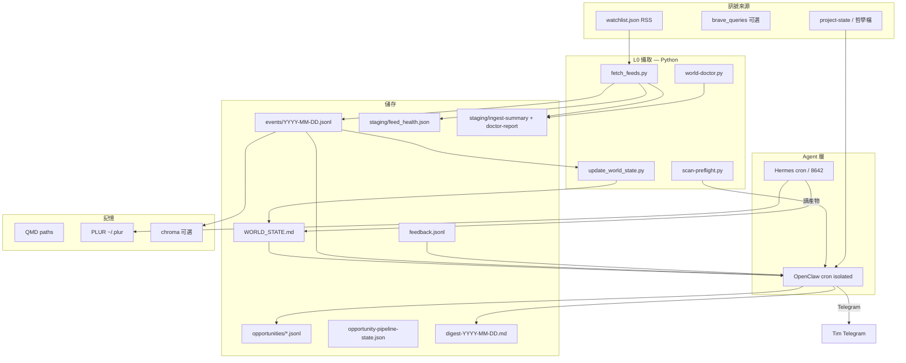

# 世界模型專案完整說明（World Awareness Project）

> **版本：** 2026-05-18 rev.2（Grok Phase 1 + Aggressive + observability）  
> **倉庫：** `~/Desktop/CL`  
> **運行環境：** OpenClaw Gateway + Hermes + 本機 workspace  
> **長文 SSOT：** 本檔 · **一日整合：** `memory/kb/digest-rss-architecture.md` · **每日速查：** `memory/kb/world/QUICKSTART.md`  
> **快速健檢：** `bash tools/world-ingest/world-doctor.sh`

---

## 目錄

1. [專案願景與邊界](#1-專案願景與邊界)
2. [系統架構](#2-系統架構)
3. [三層內容分工（Hobby / World / Hermes）](#3-三層內容分工hobby--world--hermes)
4. [三大內容域（Domains）](#4-三大內容域domains)
5. [資料模型與 Schema](#5-資料模型與-schema)
6. [檔案與目錄 SSOT](#6-檔案與目錄-ssot)
7. [工具腳本詳解](#7-工具腳本詳解)
8. [Cron 排程（OpenClaw + Hermes）](#8-cron-排程openclaw--hermes)
9. [一日時間軸（HKT）](#9-一日時間軸hkt)
10. [評分、推送與 Feedback](#10-評分推送與-feedback)
11. [記憶與檢索（QMD / PLUR / Chroma）](#11-記憶與檢索qmd--plur--chroma)
12. [安裝、升級與維運](#12-安裝升級與維運)
13. [成本與慳錢模式](#13-成本與慳錢模式)
14. [與 Tim 專案連結](#14-與-tim-專案連結)
15. [已知限制與待辦方向](#15-已知限制與待辦方向)
16. [故障排除](#16-故障排除)
17. [相關文檔索引](#17-相關文檔索引)

---

## 1. 專案願景與邊界

### 1.1 要做什麼

建立 Tim 專用嘅 **「外在世界 + 專案脈絡」持續模型**：

- 定期從 RSS（同可選 Brave）攝取結構化 **事件（events）**
- 維護一份 ≤150 行嘅 **熱狀態（WORLD_STATE）**
- 按 **相關度／置信度** 決定：只存檔、晚報摘要、或（可選）即時 Telegram
- 透過 **feedback** 同週反思 **演化評分規則**
- 高價值條目可 **匯出 PLUR**、交 **Hermes L2** 深核

### 1.2 唔做什麼

- 唔另起 CrewAI / Celery / 獨立排程服務
- 唔預設部署 Neo4j（僅 graph-lite `entities.yaml`）
- 唔自動下達「立即買賣」投資指令
- 唔與 Hobby 層重複抓取同一科技 RSS（OpenAI blog 等歸 Hobby）

### 1.3 設計原則

| 原則 | 實作 |
|------|------|
| 心跳 = OpenClaw cron | `~/.openclaw/cron/jobs.json` |
| L0 ingest 免費 | Python `fetch_feeds.py`（stdlib HTTP）+ `feed_health.json` |
| L1 快篩 | `scan-preflight.py` 條件觸發 + opportunity scan ×2（Aggressive 預設開） |
| L2 深推 | Hermes `world-verify` skill，手動／高門檻觸發 |
| 可觀測性 | `world-doctor.sh`：feed / WORLD_STATE / pipeline 健檢 |
| SSOT 分離 | 設定在 CL repo；運行態在 `~/.openclaw/workspace/memory/world/` |

---

## 2. 系統架構



### 2.1 依賴系統

| 系統 | 角色 |
|------|------|
| **OpenClaw** | Gateway、Albert agent、Telegram、`openclaw.mjs cron` |
| **Hermes** | 03:00 overnight、08:00 晨報、13:00 Research、PLUR、L2 verify |
| **CL 倉庫** | watchlist、schemas、tools、project-state、文檔 |
| **PLUR** | `@plur-ai/claw` memory slot + `~/.plur` |
| **MiniMax** | evening digest / 週任務 LLM（透過 OpenClaw provider） |

---

## 3. 三層內容分工（Hobby / World / Hermes）

| 層 | 負責 | RSS 來源 | 主要輸出 | Telegram |
|----|------|----------|----------|----------|
| **Hobby** | 好奇心、全球 AI 深度 | `~/.openclaw/workspace/hobby/collect.mjs`（~30 feeds） | `graded.md`、`overnight-suggestion.md`、`daily-digest-*.md` | 03:00 🏆、12:00 📰 |
| **World** | 投資、香港、專案世界 | `memory/kb/world/watchlist.json` | `events/*.jsonl`、`WORLD_STATE.md`、`world/digest-*.md` | 08:15 / 14:00 / 21:00 🌍（+ 週日 batch） |
| **Hermes** | 系統狀態 + 接力 | 不抓 RSS | 晨報、Research、Top 3 播報 | 03:00、08:00、13:00 |

**整合文檔：** `memory/kb/digest-rss-architecture.md`

**Cron 檔案勿混淆：**

| 檔案 | 內容 |
|------|------|
| `~/.openclaw/cron/jobs.json` | world-*（7 項）、`content-digest-hybrid-001` 等（約 29 jobs） |
| `~/.hermes/cron/jobs.json` | 雙星晨報、`overnight-content-pipeline` 等（8 jobs） |

---

## 4. 三大內容域（Domains）

定義於 `memory/kb/world/watchlist.json`（`version: 3`，時區 `Asia/Hong_Kong`）。  
**Tim 機會畫像：** `memory/kb/world/tim-opportunity-profile.md`（本地／展覽／創意 IP，唔止投資）。

### 4.1 investment（投資與市場）

- **source_trust：** 0.85
- **linked_projects：** `investment`
- **entities：** VT, 03110, 02834, 02318, ICE, IDEV
- **RSS：**
  - Yahoo Finance — `https://finance.yahoo.com/news/rssindex`
- **brave_queries（模板，cron 內可 web_search）：**
  - Hong Kong stock market ETF news
  - China Ping An 02318
  - Federal Reserve interest rate markets
- **約束：** 必讀 `docs/INVESTMENT_PHILOSOPHY.md`；禁止「立即買賣」

### 4.2 local（本地·梅窩·離島·社區）

- **linked_projects：** personal, T58, audrey, studio
- **opportunity_types：** local-life, collab
- **RSS：** Google News 梅窩/大嶼山、離島親子社區（`when:7d`）
- **重點：** 市集、渡輪、社區活動、佛行/校慶周邊 — **match Tim 生活圈**

### 4.3 hk（香港政策·文化·教育·藝術）

- **source_trust：** 0.75（domain 預設）；明報 feed 0.8
- **linked_projects：** T58, LCSD, T56
- **entities：** T58, LCSD
- **關鍵字過濾（domain 級，可被子 feed 覆寫）：**
  - `require_any`：香港／港／HK、康文署／文化／教育／T58 等
  - `exclude_any`：內地省市、以巴、美國大選／華爾街等噪音
- **RSS（現行 watchlist）：**
  - 明報 教育 — `s00007.xml`
  - 明報 文化 — `s00002.xml`
  - Google News 香港教育政策
  - Google News 香港文化藝術
  - Google News 康文署 LCSD
- **已移除：** 明報港聞（內地噪音過高）
- **brave_queries：** Hong Kong education policy；LCSD Hong Kong arts；香港 文化 政策
- **per-feed 可選：** `include_keywords` / `exclude_keywords`、`brave_fallback`、`stale_item_days`
- **Google News：** URL 加 `when:7d`；`source_trust` 0.6
- **壞源清單：** watchlist `rss_deprecated`（HKET 403、news.gov.hk 非 RSS 等）→ 僅 Brave

### 4.4 tech-ai（科技與 AI 工具）

- **source_trust：** 0.7
- **linked_projects：** openclaw, hermes
- **entities：** OpenClaw, Hermes, MiniMax
- **RSS：** `[]`（刻意留空，全球科技 feed 由 **Hobby** 負責，避免重複）
- **brave_queries：** AI agent OpenClaw；Anthropic Claude tools；local LLM agent memory

---

## 5. 資料模型與 Schema

### 5.1 World Event（`schemas/world_event.schema.json`）

每行一個 JSON 物件，寫入 `events/YYYY-MM-DD.jsonl`。

| 欄位 | 類型 | 說明 |
|------|------|------|
| `id` | string | UUID |
| `title` | string | 標題 |
| `summary` | string? | RSS description 截取 ≤500 字 |
| `domain` | enum | `investment` \| `hk` \| `tech-ai` |
| `source_name` | string? | feed 名稱 |
| `source_url` | string | 連結（去重鍵之一） |
| `published_at` | string | ISO 或日期 |
| `ingested_at` | string | UTC ISO8601 |
| `entities` | string[] | 來自 watchlist |
| `linked_projects` | string[] | 來自 watchlist |
| `confidence` | number | 0–1；預設 `0.5 + 0.5 × source_trust` |
| `source_trust` | number? | 來自 feed 或 domain 的 `source_trust`（0.1–1.0） |
| `title_hash` | string | sha256(title\|url) 前 16 位 |

**去重：** 讀取近 **7 日** jsonl 內已有 `title_hash`，跳過重複（測試用 `fetch_feeds.py --force` 略過）。  
**關鍵字：** domain 的 `require_any` / `exclude_any`；feed 可覆寫為 `include_keywords` / `exclude_keywords`。  
**每 feed 上限：** 每次最多處理 15 條 item（通過過濾後才寫入）。

### 5.2 Opportunity（`schemas/opportunity.schema.json`）

寫入 `opportunities/YYYY-MM-DD.jsonl`（由 opportunity scan 或 evening agent 產生）。

| 欄位 | 說明 |
|------|------|
| `topic_id` | 24h 推送去重鍵 |
| `relevance_score` | 0–100 |
| `confidence` | 0–100 |
| `urgency` | low \| medium \| high |
| `headline` | 標題 |
| `suggested_action` | 建議行動（考慮／核對，非交易） |
| `counterpoint` | 反方觀點 |
| `linked_projects` | 專案陣列 |
| `sources` | url + excerpt |
| `pushed_at` | 若已 Telegram 推送 |

### 5.3 WORLD_STATE.md 結構

| 區塊 | 用途 |
|------|------|
| `## [P0]` | 本週確定事實（≤12 條；評分排序 + 晨間 LLM 可覆寫） |
| `## [P1] 待驗證假設` | opportunity / agent 填入 |
| `## [P1] 與 Tim 專案連結` | 靜態表 |
| `## [P2]` | 雜訊／過期（>21 日 P0 自動移入；consolidate 再歸檔） |

**P0 行格式：** `- (YYYY-MM-DD) [domain] 標題 — https://...`

**`update_world_state.py` 邏輯（L0，免費）：**

- 讀近 **3 日** events，按 **score = source_trust × age_factor × confidence** 排序（`age_factor = max(0.15, 1 − min(age_days,30)/30)`）
- 合併現有 P0（URL 去重），保留最多 **12** 條
- **>21 日** 的 P0 行自動移至 `[P2]`

**重要：** `WORLD_STATE.md` **運行態只存在 workspace**；`sync-to-workspace.sh` **不會**用 CL 模板覆蓋已有檔案（僅首次初始化）。晨間 cron 仍可用 LLM 重寫 P0（帶粵語「點解重要」）。

### 5.4 opportunity-pipeline-state.json

| 欄位 | 說明 |
|------|------|
| `last_ingest_at` | 上次 ingest 時間 |
| `last_scan_at` | 上次 opportunity scan |
| `last_digest_at` | 上次晚報 |
| `pushed_topic_ids` | 24h 已推 topic 記錄 |
| `daily_token_budget` | 估算 token 預算追蹤 |

模板：`memory/kb/world/opportunity-pipeline-state.template.json`

### 5.5 Feedback（`feedback.jsonl`）

每行 JSON，經 `record_feedback.py` 寫入：

```bash
python3 tools/world-ingest/record_feedback.py useful "<topic_id>" "可選備註"
python3 tools/world-ingest/record_feedback.py ignore "<topic_id>" "太噪音"
python3 tools/world-ingest/record_feedback.py wrong "<topic_id>" "事實錯誤"
```

### 5.6 Staging 產物（可觀測性）

| 檔案 | 產生者 | 主要欄位 |
|------|--------|----------|
| `ingest-summary-YYYY-MM-DD.json` | `fetch_feeds.py` | `new_events`, `filtered_count`, `new_events_by_domain`, `estimated_downstream_tokens`, `errors` |
| `feed_health.json` | `fetch_feeds.py` | `feeds.{domain/name}.success_count`, `error_count`, `last_item_date`, `last_error` |
| `scan-warranted-YYYY-MM-DD.json` | `scan-preflight.py` | `warranted`, `signals`, `blockers`, `reasons`, `hit_count`, `new_events` |
| `doctor-report.json` | `world-doctor.py` | `status`（healthy / degraded / critical）, `warnings`, `critical` |
| `brave-fallback-hints-YYYY-MM-DD.json` | `fetch_feeds.py` | stale/error feed → 建議 `brave_queries`（晚報優先使用） |

---

## 6. 檔案與目錄 SSOT

### 6.1 CL 倉庫（設定與工具）

```
~/Desktop/CL/
├── docs/
│   ├── WORLD_MODEL_PROJECT.md          ← 本檔
│   ├── INVESTMENT_PHILOSOPHY.md
│   ├── project-state/
│   │   ├── investment.md
│   │   ├── T58.md
│   │   ├── T56.md
│   │   └── LCSD.md
│   └── memory-index.md
├── memory/kb/
│   ├── digest-rss-architecture.md
│   ├── openclaw-world-awareness-setup.md
│   └── world/
│       ├── watchlist.json
│       ├── scoring-rubric.md
│       ├── budget-limits.json
│       ├── entities.yaml
│       ├── strategy-patterns.md
│       ├── hermes-world-verify-prompt.md
│       ├── opportunity-pipeline-state.template.json
│       ├── WORLD_STATE.md              ← 僅模板，非運行 SSOT
│       ├── QUICKSTART.md               ← 每日指令速查
│       ├── evening-digest-prompt.md    ← 晚報 agent 模板
│       └── README.md
├── schemas/
│   ├── world_event.schema.json
│   ├── opportunity.schema.json
│   └── memory_record.schema.json
└── tools/world-ingest/
    ├── fetch_feeds.py              # RSS + feed_health + ingest-summary
    ├── update_world_state.py       # P0 評分／老化
    ├── world-doctor.py / world-doctor.sh
    ├── scan-preflight.py           # L1 scan 前 warranted 判斷
    ├── morning-world-ingest.sh
    ├── sync-to-workspace.sh
    ├── install-world-cron.sh
    ├── install-all.sh
    ├── apply-digest-schedule.mjs
    ├── world-cron-jobs.json
    ├── record_feedback.py
    ├── chroma_index.py
    ├── plur_export_high_confidence.py
    ├── ensure-qmd-path.mjs
    ├── ensure-openclaw-cli.mjs
    └── README.md
```

### 6.2 本機運行目錄

```
~/.openclaw/workspace/memory/world/
├── WORLD_STATE.md              ← 運行 SSOT（勿被 CL 模板覆蓋）
├── watchlist.json              ← sync 自 CL
├── scoring-rubric.md
├── budget-limits.json
├── entities.yaml
├── strategy-patterns.md
├── feedback.jsonl
├── opportunity-pipeline-state.json
├── events/
│   └── YYYY-MM-DD.jsonl
├── opportunities/
│   └── YYYY-MM-DD.jsonl        ← 可空
├── digest-YYYY-MM-DD.md
├── staging/
│   ├── ingest-summary-YYYY-MM-DD.json   # new_events, filtered_*, estimated_downstream_tokens
│   ├── feed_health.json                 # 每 feed 成功率、last_item_date、錯誤
│   ├── doctor-report.json               # world-doctor 最近一次結果
│   └── scan-warranted-YYYY-MM-DD.json   # L1 preflight
├── cache/
└── archive/
    └── WORLD_STATE-pre-sync-*.md       ← sync 前自動備份

~/.openclaw/workspace/memory/kb/world → symlink 至 CL/memory/kb/world

~/.openclaw/workspace/memory/qmd-root/
├── project-state-*.md          → symlink 至 CL/docs/project-state/

~/.hermes/skills/world-verify/
└── SKILL.md                    ← 由 sync 從 hermes-world-verify-prompt.md 生成
```

### 6.3 Hobby 相關（非 world 專案，但整合必讀）

```
~/.openclaw/workspace/hobby/
├── collect.mjs
├── triage.mjs
├── grading.mjs
├── overnight-build.mjs
├── raw/*.xml
└── triage/
    ├── graded.md
    ├── summary.md
    └── overnight-suggestion.md

~/.openclaw/workspace/scripts/
├── content-digest-hybrid.sh
├── content-digest-hybrid.mjs
└── run-hobby-pipeline.sh
```

---

## 7. 工具腳本詳解

### 7.1 fetch_feeds.py

- **輸入：** `memory/kb/world/watchlist.json`（或第二參數覆寫路徑）
- **輸出：**
  - append `events/YYYY-MM-DD.jsonl`
  - `staging/ingest-summary-YYYY-MM-DD.json`（含 `filtered_count`、`new_events_by_domain`、`estimated_downstream_tokens`）
  - `staging/feed_health.json`（每 feed 成功/失敗次數、`last_item_date`、`last_error`）
- **旗標：**
  - `--force` — 略過 7 日 `title_hash` 去重（仍套用關鍵字過濾）
  - `--dedupe-days N` — 自訂去重窗口（預設 7）
- **依賴：** Python 3 stdlib only；**User-Agent：** `CL-world-ingest/1.0 (+local)`

```bash
python3 tools/world-ingest/fetch_feeds.py
python3 tools/world-ingest/fetch_feeds.py --force   # 測試／補抓
```

### 7.2 update_world_state.py

- **輸入：** 近 3 日 `events/*.jsonl` + 現有 `WORLD_STATE.md`
- **邏輯：** 評分排序選 P0（≤12）；>21 日 P0 → [P2]；URL 去重
- **副作用：** 更新 `opportunity-pipeline-state.json` 的 `last_ingest_at`

### 7.3 world-doctor.sh / world-doctor.py

- **檢查：**
  - `feed_health.json` 是否存在、是否超過 24h 未更新
  - 單 feed 錯誤率 ≥30%（`success_count + error_count ≥ 3`）→ **critical**
  - feed 超過 7 日無成功或 `last_item_date` 過舊 → warning
  - `WORLD_STATE` 超過 36h 未更新、[P0] 為空或 placeholder → warning
  - `WORLD_STATE` 超過 160 行 → warning（應跑週整合）
  - pipeline `last_ingest_at` / `last_digest_at` 超過 48h → warning
  - token 估算超出 `daily_token_budget` → warning
- **狀態：** `healthy` | `degraded`（≥3 warnings）| `critical`（有 critical 項）
- **輸出：** `staging/doctor-report.json`；exit `1` 僅當有 **critical**
- **整合：** `morning-world-ingest.sh` 結尾、`world-digest-evening` cron、週日 consolidate 開頭

```bash
bash tools/world-ingest/world-doctor.sh
python3 tools/world-ingest/world-doctor.py --json
```

### 7.4 scan-preflight.py（L1 guardrail，免費）

**邏輯：** `warranted = has_signal AND NOT blockers`

| 類型 | 條件 |
|------|------|
| **信號（任一）** | entity/topic 命中；或 `hk` 當日 ≥8 條；或 ingest `new_events` ≥3 |
| **阻斷** | 無今日 `ingest-summary`；或（無命中且 hk<8 且 new_events<3）；或 4h 內已 `last_scan_at`；或 `--afternoon` 且今日 opportunities ≥5 |

- **輸出：** `staging/scan-warranted-YYYY-MM-DD.json`（含 `signals`、`blockers`、`sample_hits`）
- **旗標：** `--exit-code`（不 warrant 時 exit 1）；`--afternoon`（午間 opp 上限）
- **cron：** 08:15 / 14:00 scan 步驟 0；`warranted=false` → 只回覆 skip，**唔 LLM、唔 Telegram**

```bash
python3 tools/world-ingest/scan-preflight.py
python3 tools/world-ingest/scan-preflight.py --exit-code && echo "run L1 scan"
python3 tools/world-ingest/scan-preflight.py --afternoon --exit-code
```

### 7.5 morning-world-ingest.sh

```bash
fetch_feeds.py "$@" → update_world_state.py → world-doctor.sh → chroma_index.py（若已裝 chromadb）
```

- 從 `CL_ROOT` 執行（唔 `cd` 到 workspace）
- 晚報 cron 亦會再跑（確保當日 events 最新）

### 7.6 sync-to-workspace.sh

- 複製：scoring-rubric、entities、watchlist、budget、strategy、README
- **不複製覆蓋** `WORLD_STATE.md`（除非 workspace 不存在）
- **若已有 WORLD_STATE：** 先備份至 `archive/WORLD_STATE-pre-sync-{UTC}.md`，再 sync 其他檔
- 結尾若有 events 則自動 `update_world_state.py`
- 建立 QMD symlink、project-state symlink、Hermes world-verify skill

### 7.7 install-world-cron.sh

- 合併 `world-cron-jobs.json` → `~/.openclaw/cron/jobs.json`（按 id 更新）
- 重啟 LaunchAgent gateway

### 7.8 apply-digest-schedule.mjs

- 合併 world cron（**7 jobs**，見 §8.1）
- `content-digest-hybrid-001`：**12:00 + 20:00**（exec-only prompt）
- **Aggressive：** 啟用 morning LLM P0、scan ×2、evening Brave、weekly batch
- 停用 legacy digest jobs
- 複製 `digest-rss-architecture.md` → workspace `memory/kb/`
- 呼叫 `install-world-cron.sh`

### 7.9 install-all.sh

```bash
ensure-openclaw-cli.mjs → sync → fetch_feeds → update_world_state → chroma → install-world-cron
```

### 7.10 ensure-openclaw-cli.mjs

- 安裝 `typebox`（OpenClaw CLI 依賴）
- 將 `@plur-ai/claw` 加入 `plugins.load.paths`

### 7.11 chroma_index.py（可選 Phase 4a）

- 需本機 `chromadb`；未安裝則 exit 0 skip

### 7.12 plur_export_high_confidence.py

- 週反思時匯出高置信事實到 `plur-export.md` 供 PLUR 使用

### 7.13 record_feedback.py

- **信號：** `useful` | `ignore` | `wrong` + `topic_id` + 可選備註
- **寫入：** `feedback.jsonl`；`ignore` 降低 `pushed_topic_ids` 權重
- **觸發：** 晚報 Telegram 結尾 2 條回饋問題；Tim 回覆後由 agent exec

### 7.14 evening-digest-prompt.md

- **路徑：** `memory/kb/world/evening-digest-prompt.md`
- **用途：** 晚報 agent 步驟、Telegram 結構、Brave／opportunity 約束、回饋與 doctor 的 **可複製模板**
- **與 cron：** `world-digest-evening-001` 的 inline message 應與此檔保持一致（改 prompt 時兩邊同步）

---

## 8. Cron 排程（OpenClaw + Hermes）

### 8.1 OpenClaw — World 七項（Aggressive mode）

定義源：`tools/world-ingest/world-cron-jobs.json`（由 `apply-digest-schedule.mjs` 合併）

| ID | 排程 (HKT) | enabled | 類型 | Telegram |
|----|------------|---------|------|----------|
| `world-ingest-morning-001` | 07:30 每日 | ✅ | exec ingest + doctor + **LLM 策展 P0** | 無 |
| `world-opportunity-scan-001` | 08:15 每日 | ✅ | **preflight** → LLM L1（≤3 條） | 高相關時有 |
| `world-opportunity-scan-afternoon-001` | 14:00 每日 | ✅ | preflight → LLM L1（≤2 條） | 高相關時有 |
| `world-opportunity-weekly-001` | 週日 08:30 | ✅ | 7 日 macro batch（≤5 條） | ✅ |
| `world-digest-evening-001` | 21:00 每日 | ✅ | ingest + LLM + Brave + **回饋問題** + doctor | ✅ 🌍 |
| `world-consolidate-weekly-001` | 週日 08:45 | ✅ | **doctor 告警** + LLM 週整合 | ✅ |
| `world-reflection-weekly-001` | 週日 09:15 | ✅ | rubric + PLUR | ✅ |

**手動跑晚報：**

```bash
cd ~/Desktop/CL/openclaw
node openclaw.mjs cron run world-digest-evening-001 --expect-final --timeout 120000
```

### 8.2 OpenClaw — 內容 Digest（整合）

| ID | 排程 | 說明 |
|----|------|------|
| `content-digest-hybrid-001` | 12:00、20:00 | exec：`content-digest-hybrid.sh` + 貼 digest 頭 80 行 |
| `overnight-app-001` | 04:31 | 記憶整理（非 RSS） |

### 8.3 Hermes — 相關項（`~/.hermes/cron/jobs.json`）

| 名稱 | 排程 | 說明 |
|------|------|------|
| `overnight-content-pipeline` | 03:00 | `overnight-build.mjs` → Top 3 Telegram |
| 雙星系統晨報 | 08:00 | 系統狀態 + 可讀內容摘要 |
| 午後 Research | 13:00 | 讀 hobby summary + web 補充 |
| Content Grading (LLM) | 11:00 | 覆核 graded.md |

---

## 9. 一日時間軸（HKT）

```
03:00  Hermes   overnight-content-pipeline     🏆 Top 3 + 50字摘要
04:31  OpenClaw overnight-app-001              記憶／小改進
07:30  OpenClaw world-ingest-morning           exec + doctor + LLM 策展 P0（無 TG）
08:00  Hermes   雙星系統晨報                   ☀️
08:15  OpenClaw world-opportunity-scan         preflight → 🌍 即時（≤3，高相關）
12:00  OpenClaw content-digest-hybrid          📰 Hobby 精選（exec）
13:00  Hermes   午後 Research                   📊
14:00  OpenClaw world-opportunity-scan-afternoon  preflight → 🌍（≤2）
20:00  OpenClaw content-digest-hybrid          📰 Hobby 第二轉
21:00  OpenClaw world-digest-evening           ingest + 🌍 晚報 + Brave + 回饋 + doctor
週日   08:30 weekly macro → 08:45 consolidate（feed 告警）→ 09:15 reflection
```

**每日內容類 Telegram：至少 5 次固定**（03:00 / 12:00 / 20:00 / 21:00，加 0–5 次 🌍 即時 scan）；08:00 ☀️、13:00 📊 為 Hermes。

---

## 10. 評分、推送與 Feedback

規則檔：`memory/kb/world/scoring-rubric.md`

### 10.1 L1 推送門檻（Aggressive，scan enabled）

| relevance | confidence | 動作 |
|-----------|------------|------|
| ≥70 | ≥60，且 24h 未推同 topic | 即時 Telegram 🌍 |
| 40–69 | — | 21:00 evening digest 一行摘要 |
| <40 | — | 只寫 `opportunities/*.jsonl` |

**Preflight skip：** 見 §7.4 — 無信號日、4h 內已 scan、或午間 opportunities ≥5 時，agent 只回覆 `skip scan: …`，**唔跑 LLM**。

### 10.2 Feedback 閉環

1. 晚報 Telegram 結尾：**2 條回饋問題**（有用／雜訊／錯）
2. Tim 回覆後，agent exec：`record_feedback.py <signal> <topic_id> [note]`
3. 週日 `world-reflection-weekly-001` 讀 `feedback.jsonl`，建議 rubric 調整（append `## 自動調整`）

### 10.3 Hermes L2 觸發建議

- relevance ≥ 80，或
- confidence < 70 且 domain = investment  
→ 晚報註明「建議 Hermes 8642 核對」，**不自動 call**

Skill：`~/.hermes/skills/world-verify/SKILL.md`

### 10.4 預算

`memory/kb/world/budget-limits.json`（`mode: aggressive`）：

- 每日估算上限 **250000** tokens（MiniMax 約每 4–5h reset）
- 每 job 分項上限（morning 35k、scan 45k/35k、evening 60k…）
- `brave_max_queries_per_day`: **12**
- 超限策略：`continue_scans_and_digest_no_disable`（唔自動關 scan）

---

## 11. 記憶與檢索（QMD / PLUR / Chroma）

### 11.1 QMD

`ensure-qmd-path.mjs` 確保 `~/.openclaw/openclaw.json` 含：

```json
{
  "name": "memory-world",
  "path": "~/.openclaw/workspace/memory/world",
  "pattern": "**/*.{md,json}"
}
```

### 11.2 PLUR

- OpenClaw：`plugins.slots.memory: plur-claw`
- 插件路徑：`~/.openclaw/npm/node_modules/@plur-ai/claw`
- 週反思：`plur_export_high_confidence.py`

### 11.3 Chroma（可選）

- 腳本：`chroma_index.py`
- 未裝 chromadb 時整條 pipeline 仍可用（僅無語義檢索）

### 11.4 Graph-lite

`entities.yaml` 範例：

```yaml
entities:
  - [tim, holds, "02318", investment.md]
  - [tim, project, T58, project-state/T58.md]
  - [tim, uses, OpenClaw, memory-index.md]
```

---

## 12. 安裝、升級與維運

### 12.1 首次安裝

```bash
cd ~/Desktop/CL
chmod +x tools/world-ingest/*.sh
./tools/world-ingest/install-all.sh
node tools/world-ingest/apply-digest-schedule.mjs
```

### 12.2 日常手動

完整速查表見 **`memory/kb/world/QUICKSTART.md`**。

```bash
cd ~/Desktop/CL
bash tools/world-ingest/morning-world-ingest.sh
bash tools/world-ingest/world-doctor.sh
python3 tools/world-ingest/scan-preflight.py
# 測試略過去重：
python3 tools/world-ingest/fetch_feeds.py --force
# L1 是否值得跑（exit 1 = skip）：
python3 tools/world-ingest/scan-preflight.py --exit-code
```

### 12.3 更新 watchlist 後

```bash
./tools/world-ingest/sync-to-workspace.sh
python3 tools/world-ingest/fetch_feeds.py
```

### 12.4 開關 opportunity scan（慳錢回退）

編輯 `~/.openclaw/cron/jobs.json` → `world-opportunity-scan-001` / `afternoon-001` → `enabled: false`；或跑 `apply-digest-schedule.mjs` 前改 `budget-limits.json` 為保守模式 → 重啟 gateway。

### 12.5 OpenClaw CLI 依賴

若出現 `Cannot find package 'typebox'` 或 `plur-claw not found`：

```bash
cd ~/Desktop/CL/openclaw && pnpm add -w typebox@1.1.31
node ~/Desktop/CL/tools/world-ingest/ensure-openclaw-cli.mjs
```

### 12.6 Feed 健康與 doctor

```bash
cat ~/.openclaw/workspace/memory/world/staging/feed_health.json
cat ~/.openclaw/workspace/memory/world/staging/doctor-report.json
bash tools/world-ingest/world-doctor.sh
```

週日 consolidate cron 會根據 doctor + feed_health 在 Telegram 摘要 **error rate ≥30%** 或 **7 日無新稿** 的 feed。

---

## 13. 成本模式

### 13.1 Aggressive mode（現行，2026）

MiniMax 配額約 **每 4–5 小時 reset**；策略係 **用盡世界層 + hybrid**，唔人為關 scan。

| 項目 | 費用 |
|------|------|
| `fetch_feeds.py` / `update_world_state.py` | 免費 |
| `world-ingest-morning` | MiniMax（exec + LLM 策展 P0） |
| `world-opportunity-scan` ×2 + weekly batch | MiniMax + 0–5 次 Telegram/日 |
| `world-digest-evening` | MiniMax（較大 prompt）+ 最多 **12** Brave/日 + ingest/doctor |
| 週日 weekly / consolidate / reflection | MiniMax |
| `content-digest-hybrid` | 12:00 + 20:00（exec，低 token） |
| Hermes L2 | 手動時才計費 |

設定：`memory/kb/world/budget-limits.json` — `mode: aggressive`，`daily_max_estimated_tokens: 250000`，`on_budget_exceeded: continue_scans_and_digest_no_disable`。

套用：`node tools/world-ingest/apply-digest-schedule.mjs`

### 13.2 慳錢模式（可選回退）

- 關 `world-opportunity-scan-afternoon-001`，`world-opportunity-scan-001` 設 `enabled: false`
- hybrid 改回 `0 12 * * *`
- 晨間改回純 exec prompt

---

## 14. 與 Tim 專案連結

| 專案 | world 域 | 關鍵檔 |
|------|----------|--------|
| 投資 | investment | `docs/INVESTMENT_PHILOSOPHY.md`、`docs/project-state/investment.md` |
| T58 校慶展 | hk | `docs/project-state/T58.md` |
| LCSD | hk | `docs/project-state/LCSD.md` |
| OpenClaw / Hermes | tech-ai（Brave） | workspace AGENTS、`docs/HANDOFF_HERMES.md` |
| 豆豆 / MindForge | 非主 RSS 軸 | `memory-index.md` |

Evening digest **必讀** investment 哲學與 project-state，輸出需含 **專案連結表** 與 **明日跟進 1 項**。

---

## 15. 已知限制與待辦方向

### 15.1 已知限制

- ~~明報港聞噪音~~ → **已處理（2026-05）**：移除明報港聞 feed；`hk.require_any` / `exclude_any` + `fetch_feeds.py` 過濾；ingest summary 含 `filtered_count`
- 政府新聞處部分 RSS 404，需 Brave 或手動更新 URL
- HKET / SCMP 等或 403 / XML 解析失敗
- Google News 等聚合 feed 的 `last_item_date` 可能偏舊（doctor ⚠️，非 necessarily 壞）
- OpenClaw CLI 版本可能落後 gateway 設定版本
- `new_events: 0` 屬正常（7 日去重）；測試用 `--force`
- 晨間 **LLM P0** 與 **L0 update_world_state** 可能短暫不一致（以 cron 最後寫入為準）

### 15.2 演進方向（優先序可調）

**已完成（2026-05）：**

- hk feed 降噪：`watchlist.json` + `fetch_feeds.py` filters  
- 週日 macro batch：`world-opportunity-weekly-001`（週日 08:30）  
- 條件式 L1 scan：`scan-preflight.py` → 靜日 skip LLM  
- **Grok Phase 1（2026-05-18）**：`feed_health.json`、`world-doctor`（healthy/degraded/critical）、P0 評分/老化、`--force`、per-feed keywords、ingest token 估算、晚報回饋 + doctor  
- **文檔與 guardrail（rev.2）**：`QUICKSTART.md`、`evening-digest-prompt.md`；`scan-preflight` 合併 ingest 量／opp 上限／4h 冷卻／entity 命中；`sync` 備份 WORLD_STATE  

**待做：**

1. 一週觀察 + Telegram feedback → rubric 調權（已接晚報 prompt，待 Tim 回覆累積）  
2. 雙星晨報明確引用 `WORLD_STATE [P0]`  
3. Chroma / 語義緩存（第四波）  
4. Telegram inline 按鈕（wave 4）  
5. Hermes L2 條件自動觸發  
6. 擴充 `entities.yaml`  
7. OpenClaw / gateway 版本對齊  

---

## 16. 故障排除

| 現象 | 原因 | 處理 |
|------|------|------|
| `Cannot find package 'typebox'` | openclaw 缺依賴 | `pnpm add -w typebox` + `ensure-openclaw-cli.mjs` |
| `plugin not found: plur-claw` | 缺 plugins.load.paths | `ensure-openclaw-cli.mjs` |
| `[P0] 待 ingest` | sync 曾覆蓋 WORLD_STATE | 已修 sync；跑 `update_world_state.py` |
| `new_events: 0` | 7 日去重 | 正常；`fetch_feeds.py --force` 測試 |
| `filtered_count` 高 | hk 關鍵字過濾 | 預期；調 `require_any` / `exclude_any` |
| doctor：feed stale | 聚合源無新稿 | 考慮換 feed 或靠 Brave 補 |
| doctor：WORLD_STATE stale | 未跑 ingest | `morning-world-ingest.sh` |
| skip scan: preflight | 無信號／4h 內已掃／opp≥5 | 正常；查 `scan-warranted-*.json` |
| Preflight: Warranted 但 new_events=0 | 去重後仍有多條 **當日** events | 正常；信號來自 hk 量或 entity 命中 |
| cron run 只 `enqueued` | 需 gateway 執行 | 確認 `openclaw gateway status` |
| evening 讀錯 investment 路徑 | agent 猜路徑 | cron prompt 已用完整路徑 |
| digest 話「無 hk feed」 | 舊 run / 未 ingest | 確認 watchlist hk rss + fetch |

---

## 17. 相關文檔索引

| 文檔 | 路徑 |
|------|------|
| 本檔（完整說明） | `docs/WORLD_MODEL_PROJECT.md` |
| 一日整合圖 | `memory/kb/digest-rss-architecture.md` |
| 安裝與成本 | `memory/kb/openclaw-world-awareness-setup.md` |
| World KB README | `memory/kb/world/README.md` |
| 工具 README | `tools/world-ingest/README.md` |
| 每日速查 | `memory/kb/world/QUICKSTART.md` |
| 晚報 prompt 模板 | `memory/kb/world/evening-digest-prompt.md` |
| Memory 總索引 | `docs/memory-index.md` |
| OpenClaw 索引 | `docs/OPENCLAW_INDEX.md` |

---

*Generated for Tim Yuen — World Awareness / 世界模型專案。*

**變更時請同步：** 本檔 · `digest-rss-architecture.md` · `memory/kb/world/QUICKSTART.md` ·（若改晚報流程）`evening-digest-prompt.md` + `world-cron-jobs.json`
